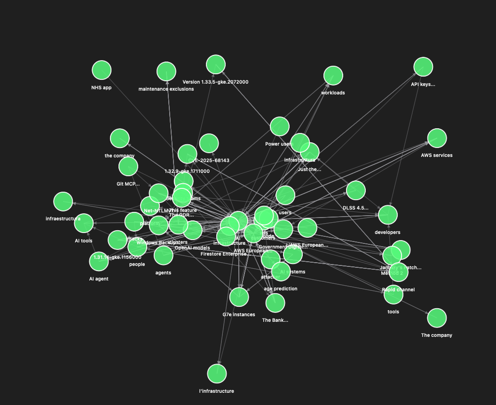
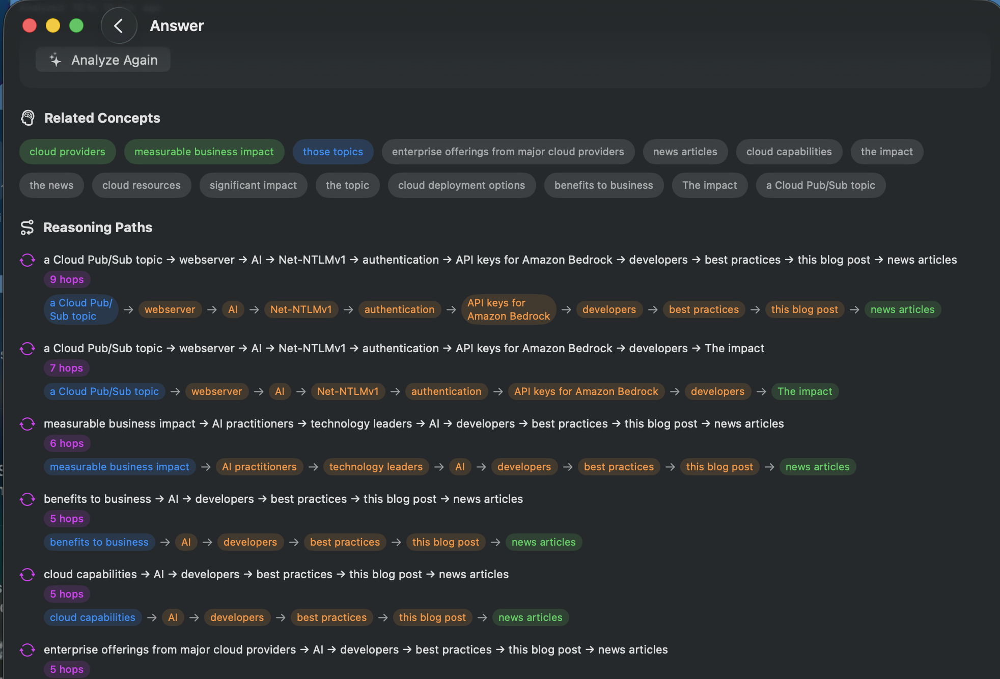
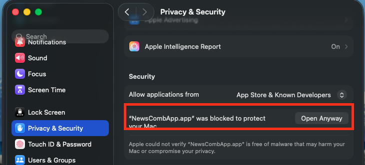

# NewsComb

A macOS app that transforms RSS news feeds into an interactive knowledge graph, enabling semantic search and multi-hop reasoning across your news sources.

## Overview

NewsComb retrieves articles from your RSS feeds and uses LLM-powered extraction to build a **semantic hypergraph** — a knowledge graph where entities (companies, people, products, technologies) are connected by relationships extracted from the news.



### Key Features

- **RSS Feed Aggregation**: Subscribe to multiple tech news feeds and automatically fetch new articles
- **Knowledge Graph Construction**: Extract entities and relationships using configurable LLM prompts
- **Vector Search with sqlite-vec**: Embeddings are stored locally using [sqlite-vec](https://github.com/asg017/sqlite-vec), enabling fast cosine similarity search without external dependencies
- **Multi-hop Reasoning Paths**: Answer questions by traversing the hypergraph to find connections between concepts, even when they aren't directly linked

### Reasoning Paths

When you ask a question, NewsComb doesn't just search for keywords — it finds **reasoning paths** through the knowledge graph. For example, asking about AI chip competition might reveal paths like:

`NVIDIA → competes with → AMD → partners with → Microsoft → invests in → OpenAI`

These multi-hop connections surface relationships that wouldn't appear in a simple text search.



### Deep Analysis

The "Dive Deeper" feature uses a multi-agent workflow to synthesize insights with academic-style citations and generate hypotheses for further investigation.

## Installation

1. Download the latest DMG from [Releases](https://github.com/iliasaz/NewsComb/releases)
2. Open the DMG and drag `NewsCombApp.app` to your Applications folder
3. Eject the DMG

## First Launch

Since the app is not signed with an Apple Developer certificate, macOS will block it on first launch.

**To open the app:**

1. Try to open `NewsCombApp.app` — macOS will show a warning that it cannot verify the developer
2. Open **System Settings** → **Privacy & Security**
3. Scroll down to find the message *"NewsCombApp.app" was blocked to protect your Mac*
4. Click **Open Anyway**



5. macOS will ask you to confirm twice more — click **Open** each time

After this one-time setup, the app will open normally.

## Setup

### Embeddings (Required)

NewsComb uses local embeddings for the knowledge graph. You need to install Ollama and download the nomic-embed-text model:

1. Install [Ollama](https://ollama.com/download)
2. Open Terminal and run:
   ```bash
   ollama pull nomic-embed-text
   ```

### LLM Provider (Required for Q&A)

To use the "Ask Your News" feature, you need to configure an LLM provider in the app's Settings.

**Recommended: OpenRouter**

1. Create an account at [OpenRouter](https://openrouter.ai/)
2. Generate an API key
3. In NewsComb Settings, select OpenRouter as the provider and enter your API key
4. Use `meta-llama/llama-4-maverick` as the model for best results

**Alternative: Local Ollama**

You can run an LLM locally with Ollama, but this will be significantly slower:

```bash
ollama pull qwen2.5:14b
```

Then select Ollama as the provider in Settings and use `qwen2.5:14b` as the model.

## Credits & Acknowledgements

### Research Foundation

This project is inspired by and builds upon the hypergraph reasoning approach described in:

**[HyperGraphRAG: Hypergraph-Driven Reasoning and Affordable LLM-Based Knowledge Construction](https://arxiv.org/pdf/2601.04878)**

> Buehler, M.J. (2025). A novel approach using hypergraphs for knowledge organization and reasoning, enabling multi-hop traversal and affordable construction via small language models.

The original Python implementation is available at: [lamm-mit/HyperGraphReasoning](https://github.com/lamm-mit/HyperGraphReasoning)

### Technical Resources

- **[GRDBCustomSQLiteBuild](https://github.com/SwiftedMind/GRDBCustomSQLiteBuild)** — Invaluable guide for integrating sqlite-vec with GRDB in Swift, enabling local vector search without external services

## License

MIT License — see [LICENSE](LICENSE) for details.
