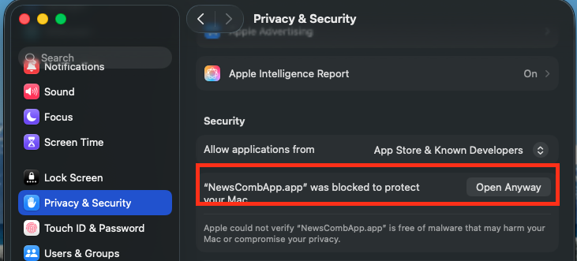

# NewsComb

A macOS app that transforms RSS news feeds into an interactive knowledge graph, enabling semantic search and multi-hop reasoning across your news sources.

## Overview

NewsComb retrieves articles from your RSS feeds and uses LLM-powered extraction to build a **semantic hypergraph** — a knowledge graph where entities (companies, people, products, technologies) are connected by relationships extracted from the news.


### Key Features

- **RSS Feed Aggregation**: Subscribe to multiple tech news feeds and automatically fetch new articles
- **Knowledge Graph Construction**: Extract entities and relationships using configurable LLM prompts
- **Vector Search with sqlite-vec**: Embeddings are stored locally using [sqlite-vec](https://github.com/asg017/sqlite-vec), enabling fast cosine similarity search without external dependencies
- **Multi-hop Reasoning Paths**: Answer questions by traversing the hypergraph to find connections between concepts, even when they aren't directly linked

### Reasoning Paths

When you ask a question, NewsComb doesn't just search for keywords — it finds **reasoning paths** through the knowledge graph. For example, asking about AI chip competition might reveal paths like:

`NVIDIA → competes with → AMD → partners with → Microsoft → invests in → OpenAI`

These multi-hop connections surface relationships that wouldn't appear in a simple text search.


### Deep Analysis

The "Dive Deeper" feature uses a multi-agent workflow to synthesize insights with academic-style citations and generate hypotheses for further investigation.

## Installation

1. Download the latest DMG from [Releases](https://github.com/iliasaz/NewsComb/releases)
2. Open the DMG and drag `NewsCombApp.app` to your Applications folder
3. Eject the DMG

## First Launch

Since the app is not signed with an Apple Developer certificate, macOS will block it on first launch.

**To open the app:**

1. Try to open `NewsCombApp.app` — macOS will show a warning that it cannot verify the developer
2. Open **System Settings** → **Privacy & Security**
3. Scroll down to find the message *"NewsCombApp.app" was blocked to protect your Mac*
4. Click **Open Anyway**



5. macOS will ask you to confirm twice more — click **Open** each time

After this one-time setup, the app will open normally.

## Workspaces

A **workspace** is a folder on disk that holds the SQLite database and any side artifacts for one knowledge base. NewsComb supports multiple workspaces so you can keep, say, a "Tech News" workspace separate from a "Confluence" workspace. Each workspace has its own settings, feeds, articles, knowledge graph, and theme clusters.

### What's in a workspace

```
~/Documents/NewsComb-Workspaces/Tech/
  newscomb.sqlite     ← all data and settings for this workspace
```

### Resolution order at launch

NewsComb picks the active workspace on launch using the first match it finds:

1. `--workspace <path>` command-line argument
2. `NEWSCOMB_WORKSPACE` environment variable
3. The last workspace you opened (remembered in `UserDefaults`)
4. The legacy database at `~/Library/Application Support/NewsComb/newscomb.sqlite`, if present (existing installs migrate seamlessly)
5. A first-run picker sheet — Create New Workspace or Open Existing

### Managing workspaces from the UI

- **File → New Workspace…** (⇧⌘N) — pick or create a folder. When the folder is brand-new, the current workspace's settings (LLM provider + API keys, embedding model, prompts, algorithm parameters) are copied into the new one so you don't have to reconfigure.
- **File → Open Workspace…** (⇧⌘O) — open an existing workspace folder. No settings copy — the target's own settings are used.
- **File → Open Recent Workspace** — last 10 workspaces.
- **File → Reveal Workspace in Finder**.
- **Settings → Workspace** — shows the active path, a **Switch Workspace…** button, and an **Open Default Workspace** button that returns to the legacy `~/Library/Application Support/NewsComb/` location.

Switching workspaces relaunches the app so each workspace gets a clean process state. NewsComb refuses to switch while long-running jobs (knowledge graph processing, RSS refresh, OPML import, theme clustering, etc.) are in flight — wait for them to finish or cancel them first.

### App-global vs. workspace-scoped settings

| Scope | Location | Examples |
|-------|----------|----------|
| **Workspace** | `app_settings` table inside each workspace's `newscomb.sqlite` | LLM model, embedding dimension, RAG params, feeds, themes |
| **App-global** | `UserDefaults` | last-opened workspace, recent workspaces list |

## Setup

### Embeddings

NewsComb uses on-device Nomic embeddings by default for the knowledge graph — no external service required. Alternatively, you can select an OpenRouter embeddings model in Settings.

### LLM Providers

NewsComb uses two separate LLM configurations:

1. **Knowledge Extraction LLM** — Used to extract entities and relationships from articles when building the knowledge graph
2. **Analysis LLM** — Used for answering questions ("Ask Your Knowledge Graph") and deep analysis ("Dive Deeper")

Both can be configured independently in Settings, allowing you to use different models for each task.

#### Recommended: OpenRouter

1. Create an account at [OpenRouter](https://openrouter.ai/)
2. Generate an API key
3. In NewsComb Settings:
   - **Knowledge Extraction**: Select OpenRouter and use `meta-llama/llama-4-maverick`
   - **Analysis**: Use the same model or a stronger one (e.g., `openai/gpt-5.2` for more nuanced reasoning)

The Llama 4 Maverick model provides an excellent balance of speed and quality for entity extraction. For analysis, you may want a more capable model if you need deeper reasoning, but Maverick works well for most use cases.

#### Alternative: Local Ollama

You can run LLMs locally with Ollama, but this will be significantly slower:

```bash
ollama pull qwen2.5:14b
```

Then select Ollama as the provider in Settings and use `qwen2.5:14b` as the model for both extraction and analysis.

## MCP Server (AI Assistant Integration)

NewsComb includes a built-in [Model Context Protocol](https://modelcontextprotocol.io/) (MCP) server that gives AI assistants read-only access to your knowledge graph. This lets tools like Claude Code and Claude Desktop search concepts, explore relationships, discover reasoning paths, and run full RAG queries — all backed by your local database.

### Available Tools

| Tool | Description |
|------|-------------|
| `query_knowledge_graph` | Full RAG pipeline: keyword extraction, vector search, BFS reasoning paths, context assembly |
| `search_concepts` | Full-text search for entities/concepts in the knowledge graph |
| `search_chunks` | Full-text search over article text chunks |
| `get_node_neighbors` | Explore relationships connected to a concept |
| `find_paths` | Discover multi-hop reasoning paths between two concepts |
| `get_themes` | Browse HDBSCAN-discovered story theme clusters |
| `get_theme_details` | Detailed view of a specific theme (entities, exemplars, articles) |
| `get_statistics` | Knowledge graph counts (nodes, edges, articles, embeddings) |
| `get_recent_articles` | List recently ingested articles from RSS feeds |

### Architecture

The MCP server runs inside the app process and listens on `http://127.0.0.1:63548`. A lightweight bridge CLI (`newscomb-mcp-bridge`) translates between Claude Code's stdio protocol and the app's HTTP endpoint — the same pattern Xcode uses with its `mcpbridge`.

```
Claude Code ←stdio→ newscomb-mcp-bridge ←HTTP→ NewsCombApp (localhost:63548)
```

The app must be running before Claude Code connects (just like Xcode).

### Building the Bridge

```bash
cd NewsCombMCPBridge
swift build -c release
```

The compiled binary will be at `.build/release/newscomb-mcp-bridge`.

### Setup for Claude Code

Add the following to your project's `.mcp.json` file (create it in the repository root if it doesn't exist):

```json
{
  "mcpServers": {
    "newscomb": {
      "command": "/path/to/NewsComb/NewsCombMCPBridge/.build/release/newscomb-mcp-bridge",
      "args": ["--workspace", "/Users/you/Documents/NewsComb-Workspaces/Tech"]
    }
  }
}
```

The `--workspace` argument is **optional but recommended**. When set, the bridge asserts that the running NewsComb app is on the matching workspace; mismatches surface a clear JSON-RPC error rather than silently returning data from the wrong knowledge base. You can also pass the workspace via the `NEWSCOMB_WORKSPACE` environment variable.

You can keep a separate `.mcp.json` per project, each pointing at a different workspace — open the matching workspace in NewsComb (File → Open Workspace…) before starting the Claude Code session.

### Setup for Claude Desktop

Add the same configuration to your Claude Desktop settings file:

- **macOS:** `~/Library/Application Support/Claude/claude_desktop_config.json`

```json
{
  "mcpServers": {
    "newscomb": {
      "command": "/path/to/NewsComb/NewsCombMCPBridge/.build/release/newscomb-mcp-bridge",
      "args": ["--workspace", "/Users/you/Documents/NewsComb-Workspaces/Tech"]
    }
  }
}
```

### Prerequisites

1. **NewsComb must be running** — launch the app before starting Claude Code. The MCP HTTP server starts automatically on app launch.
2. The running app must be on the workspace your `--workspace` arg names (or omit the arg to skip the check).
3. The app must have RSS sources configured and articles fetched.
4. The knowledge extraction pipeline must have processed at least some articles (check Settings for extraction status).

### Limitations

- All access is read-only — the MCP server cannot modify your knowledge graph or RSS sources
- `query_knowledge_graph` uses on-device Nomic embeddings by default (or OpenRouter if configured in Settings); other tools work without embeddings
- The bridge exits with an error if the app is not running

## Credits & Acknowledgements

### Research Foundation

This project is inspired by and builds upon the hypergraph reasoning approach described in:

**[HyperGraphRAG: Hypergraph-Driven Reasoning and Affordable LLM-Based Knowledge Construction](https://arxiv.org/pdf/2601.04878)**

> Buehler, M.J. (2025). A novel approach using hypergraphs for knowledge organization and reasoning, enabling multi-hop traversal and affordable construction via small language models.

The original Python implementation is available at: [lamm-mit/HyperGraphReasoning](https://github.com/lamm-mit/HyperGraphReasoning)

### Technical Resources

- **[GRDBCustomSQLiteBuild](https://github.com/SwiftedMind/GRDBCustomSQLiteBuild)** — Invaluable guide for integrating sqlite-vec with GRDB in Swift, enabling local vector search without external services

## License

MIT License — see [LICENSE](LICENSE) for details.
