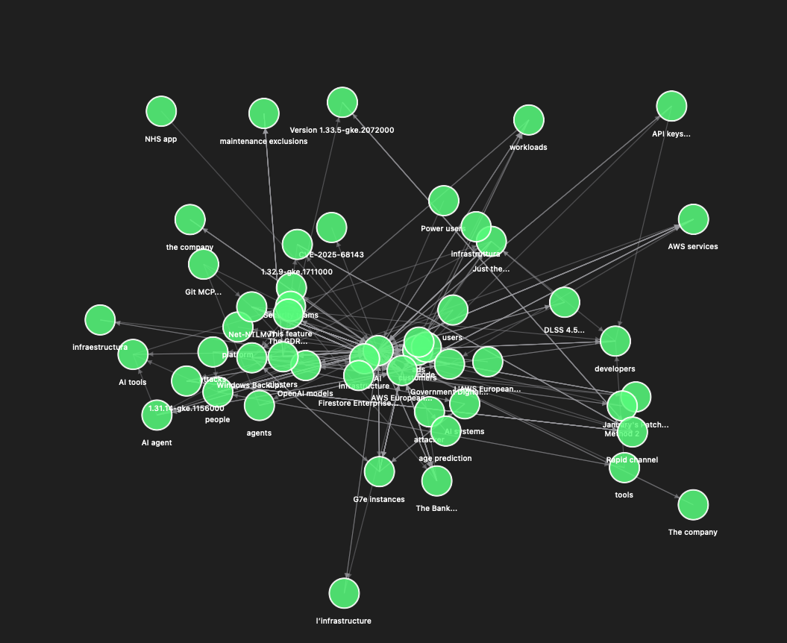
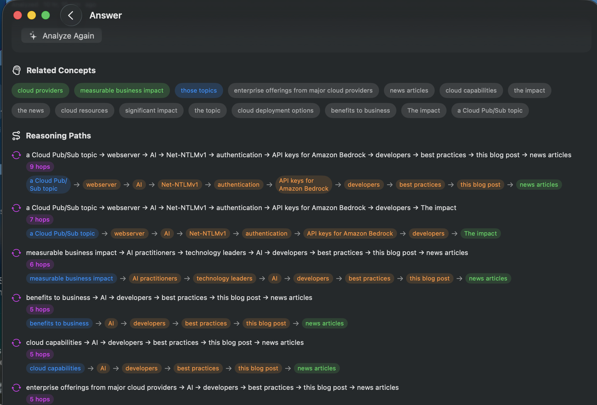
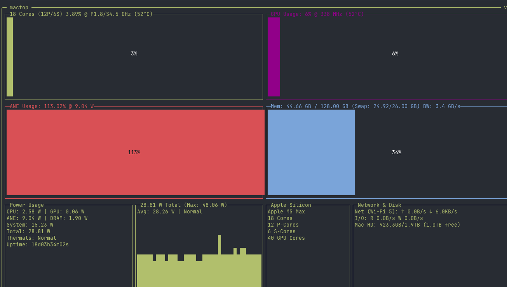

# From RSS Feed to Strategic Insights: Building a News Intelligence System

*How we implemented Knowledge Hypergraph, PCA, UMAP, and HDBSCAN from scratch in Swift, and what Apple Silicon's hardware taught us about algorithm design.*

---

## The Challenge

Imagine you work in an innovation team at a large tech company. Your job is to advise executive leadership on where to invest — which emerging technologies to bet on, which startup signals to amplify, which research breakthroughs are two years from production, and what the competitors are cooking up. You subscribe to 500+ RSS feeds across tech news, academic preprints, indie blogs, startup announcements and competitor news feeds.

The mainstream trends are easy: analyst firms cover them. The problem is analyzing the stuff that hasn't become the mainstream yet. Bleeding-edge research lives in papers nobody on the business side reads. Startup and indie signals are buried in noise — for every breakthrough, there are a hundred "we're disrupting X" announcements that lead nowhere.

What you need isn't another RSS reader or search engine. You need a system that reads everything, extracts structured knowledge while preserving cause-and-effect, finds hidden connections across unrelated sources, and answers in-depth questions like "what startups are working on the same problem this physics paper just described?".

This is the story of building that system. Over a several weekends, we went from a research paper to a macOS application that extracts knowledge graphs from news, clusters news events into themes, and uses causality knowledge to get deep insights on user questions.

---

## The Business Case: Technology Radar on Autopilot

Here's the concrete scenario. Your innovation team monitors three signal layers:

**Layer 1: Mainstream trends.** Well-covered by Gartner, Forrester, and the tech press and aggregators like TL;DR. You know about them. So does everyone else.

**Layer 2: Bleeding-edge research.** A materials science paper describes a new substrate for photonic computing. An MIT group publishes on neuromorphic architectures. These are high-signal but narrow audience.

**Layer 3: Startup and indie signals.** A YC company pivots to "AI inference at the edge." An indie developer open-sources a framework for federated fine-tuning. Most of these go nowhere, but the ones that succeed reshape markets. OpenClaw is a vivid example of this.

The value of a hypergraph-based system is in finding **convergence across layers**. When a physics paper, a startup pivot, and a customer feature request on your platform all point at the same capability gap — that's an investment signal. But no human can read 500 feeds and make those connections consistently.

A knowledge hypergraph can. The system ingests articles across all three layers, extracts entities and relationships, and builds a queryable graph. The reasoning paths explain *why* trends are connected: `photonic computing → enables → low-latency inference → required by → edge AI → demanded by → autonomous vehicles`. An analyst would need weeks to trace that chain. The graph does it in seconds.

Beyond individual connections, the system automatically **clusters thousands of events into themes**. The clustering pipeline groups semantically related events — "edge AI inference" emerges as a coherent theme from 40 articles across 15 feeds, spanning a research paper, three startup announcements, and a dozen industry analyses. These themes become an automated technology radar: each theme is a strategic signal, ranked by size and density, with representative articles and top entities surfaced for the analyst.

The real output: turning strategic awareness from an editorial process (humans reading and synthesizing) into a computational one (automated extraction, clustering, and reasoning).

---

## The Research Foundation

We built on the hypergraph reasoning framework described by Stewart & Buehler (2026) in *Higher-Order Knowledge Representations for Agentic Scientific Reasoning*, which constructs hypergraph-based knowledge representations that faithfully encode multi-entity relationships and enables agentic reasoning via node-intersection graph traversal. The approach showed that small language models can extract high-quality Subject-Verb-Object triples from text, and that hypergraph topology enables multi-hop reasoning that traditional RAG cannot. This section covers the core algorithmic ideas that make the system work.

### Why a Hypergraph?

The foundation matters. When we started, the natural question was: what data structure captures knowledge from news articles?

**Plain RAG** (Retrieval-Augmented Generation) chunks articles, embeds them, and retrieves relevant chunks at query time. It works for simple lookups but has no notion of entities, relationships, or reasoning paths. Ask "how are Apple and OpenAI connected?" and RAG searches for chunks containing both terms — it can't traverse a chain of relationships.

**Property graphs** (Neo4j-style) connect entities with typed edges. Better, but they have a fundamental limitation: each edge connects exactly two nodes. Consider the event "Apple, Google, and Samsung compete in the smartphone market." A binary graph needs three separate edges (Apple-Google, Apple-Samsung, Google-Samsung), losing the information that this was one event with one verb and three participants. Triple that across thousands of articles and you get a graph with inflated edge counts and diluted semantics.

**Hypergraphs** solve this. A hyperedge can connect any number of nodes. That competition event becomes a single hyperedge with three source nodes, one target node, and the relation "competes in." The semantic unit — the original event as extracted from the article — is preserved intact.

Our implementation extracts S-V-O triples from news articles using configurable LLMs: cloud models via OpenRouter (Meta Llama 4 Maverick, GPT-4.1, etc.), local models via Ollama, or — as of the latest release — **Apple's on-device Foundation Model** through the Foundation Models framework. Each triple becomes a hyperedge in an incidence-based storage model: entities (nodes), relationships (edges), and participation records (which nodes play which roles — source, target, context — in which edges). The result: a knowledge graph where "Apple announces Vision Pro partnership with Unity and Adobe" is one event, not six binary edges.

The hypergraph structure directly enables **multi-hop reasoning**. When a user asks "what companies are investing in quantum computing?", the system doesn't just search for documents — it traverses the graph, following chains of relationships: `Company A → invests in → Startup B → develops → Technology C → based on → Research from Lab D`. Each hop is a real extracted event with provenance back to the source article. The answer is grounded in causal structure, not keyword matching.

### Embeddings and Graph Simplification

Raw extraction produces noise — the same entity appears under different names ("Google", "Alphabet", "Google DeepMind"). To handle this, every node gets a **vector embedding**: a 768-dimensional numerical representation of its meaning, computed by the Nomic Embed Text v1.5 model running on-device via Apple's MLX framework. Nodes whose embeddings are highly similar (cosine similarity above a configurable threshold) are automatically merged, collapsing duplicates while preserving all their relationships.

These embeddings serve double duty. Beyond graph simplification, they power **semantic search**: when a user asks a question, the query is embedded and compared against node embeddings to find relevant starting points in the graph. This combines the precision of graph traversal with the flexibility of vector similarity — you can find relevant nodes even when the exact terminology differs from what's in the graph.

We initially relied on an external Ollama process for embedding computation, but the bugs in Ollama’s implementation of Nomic embedding model and need to install a separate app made this option less favorable. Switching to on-device inference and running natively inside the application eliminated the dependency. After optimizing with batched GPU encoding (processing 64 texts per forward pass instead of one at a time), throughput went from 9 to 287 embeddings per second on an M5 — a 32x improvement.

### HDBSCAN: Finding Themes in the Noise

With tens of thousands of events extracted, the next challenge is organization. Which events belong together? What are the major themes?

We chose **HDBSCAN** (Hierarchical Density-Based Spatial Clustering of Applications with Noise) for this. The intuition is simple: **find the crowds, ignore the wanderers.** In a scatter plot, clusters are dense regions where points huddle together. Noise is the sparse no-man's-land between them.

Why HDBSCAN over alternatives? K-means requires you to specify the number of clusters upfront — but we don't know how many themes exist in today's news. It also forces every point into a cluster, even outliers. News themes aren't uniform: "AI chip competition" might involve 500 events while "quantum error correction" involves 20. K-means would either fragment the large cluster or absorb the small one. HDBSCAN handles varying cluster sizes, discovers the number of clusters automatically, and explicitly labels low-confidence points as noise rather than forcing them into ill-fitting groups.

The algorithm works by building a hierarchy of density levels. Imagine slowly raising the "sea level" across the scatter plot — dense islands emerge first, then merge as the water rises. HDBSCAN records this hierarchy and selects the most stable clusters: the ones that persist across the widest range of density thresholds.

### UMAP: The Manifold Hypothesis

HDBSCAN worked perfectly on test data. On real data at scale — 89K events in 2,316 dimensions — sometimes the clustering was subpar. Some clusters came out huge while others too small. The culprit: the **curse of dimensionality**. In 2,316 dimensions, every point is approximately equidistant from every other point. Density loses meaning when there are no meaningful density differences to detect.

The insight came from the topic modeling community. **BERTopic** and **Top2Vec** — the dominant approaches for clustering text embeddings — both use the same pipeline: reduce dimensions first, then cluster. PCA strips linear noise (2,316D down to 50D), then UMAP captures the nonlinear structure (50D down to 25D).

**UMAP** (Uniform Manifold Approximation and Projection) is built on a beautiful idea: **the manifold hypothesis.** Even though your vectors live in 2,316 dimensions, the *meaningful* structure — the patterns, the clusters, the relationships — lives on a much lower-dimensional surface embedded in that space. Think of a sheet of paper crumpled into a ball. The paper is 2D; the ball is 3D. UMAP finds the crumpled paper and flattens it back out — without tearing it.

More precisely: UMAP preserves **local neighborhoods.** Points that are close in the original space remain close in the reduced space. Global structure (which clusters are near which other clusters) is also preserved.

The implementation has three stages:

**Stage 1: Build a neighborhood graph.** For each of the 89K points, find its 15 nearest neighbors. This creates a sparse graph capturing local structure.

**Stage 2: Compute fuzzy membership strengths.** Not all neighbors are equally close. UMAP converts hard kNN relationships into soft membership weights using an exponential kernel, then symmetrizes the graph.

**Stage 3: Optimize a low-dimensional layout.** Starting from random positions in 25 dimensions, stochastic gradient descent iteratively adjusts the embedding. Connected points are pulled together; random non-neighbors are pushed apart. After 200 epochs, the 25D layout preserves the local structure of the original space.

### The Theme Generation Pipeline

These components come together in an end-to-end pipeline that transforms raw hypergraph events into labeled story themes:

1. **Event vector construction.** Each hyperedge becomes a dense vector by pooling the embeddings of its participant nodes, weighted by IDF (Inverse Document Frequency — hub entities like "AI" or "cloud" are down-weighted so they don't dominate). The source embeddings, target embeddings, a directional difference vector, and a relation family one-hot encoding are concatenated into a 2,316-dimensional event vector.

2. **PCA pre-reduction.** Linear projection strips noise dimensions: 2,316D down to 50D, retaining the principal components that explain the most variance.

3. **UMAP manifold learning.** Nonlinear reduction from 50D to 25D, preserving local neighborhood structure while collapsing the space to a dimension where density is meaningful.

4. **HDBSCAN clustering.** Density-based clustering on the 25D embedding discovers themes automatically — no predefined number of clusters, no forcing outliers into groups.

5. **Cluster enrichment.** For each cluster, the system computes a centroid, identifies top entities by IDF-weighted frequency, selects exemplar events (closest to centroid), and generates an auto-label. Optionally, an LLM reads the exemplar sentences and produces a human-readable headline and summary for each theme.

6. **Post-processing.** Similar clusters (centroid cosine similarity above 0.85) are merged to consolidate fragmented themes.

The pipeline is triggered by a single button press and runs with progressive status updates.

---

## User Experience

### Visual Exploration

An interactive force-directed graph visualization lets users pan, zoom, and expand node neighborhoods. Double-tap a node to reveal its connections; single-tap for details. The physics-based layout naturally clusters related entities, giving users an intuitive spatial sense of the knowledge landscape — before any formal clustering algorithm runs.


*Force-directed knowledge graph: entities cluster naturally by connectivity. Dense neighborhoods indicate highly connected topics.*

### Conversational Querying and In-Depth Reports

A knowledge graph you can't query is just a database. When a user asks "what companies are investing in quantum computing?", an AI agent executes a six-phase pipeline: extract keywords, embed them, search for related nodes via cosine similarity, discover multi-hop reasoning paths via BFS, gather context from article provenance, and stream a grounded answer.

The answers include reasoning paths — causal chains like:

```
NVIDIA → competes with → AMD → partners with → Microsoft → invests in → OpenAI
```

These paths are traversed from the actual graph structure, not hallucinated. The key distinction from vanilla LLM chat: every claim is grounded in the causality captured by the graph.


*Multi-hop reasoning paths: each chain traces real extracted events from the knowledge graph, with hop count and visual path display.*

**In-depth reports.** "Dive Deeper" triggers a multi-agent workflow: an Engineer agent synthesizes findings with academic-style citations (`[1]`, `[2]`), and a Hypothesizer agent generates follow-up research questions and experiment suggestions. This turns a simple query into a 2-3 page analysis that an innovation team can present to leadership.

### Story Themes

The clustering pipeline produces a thematic overview: each theme gets an auto-generated label (top entities + dominant relationship type), a size indicator, and optionally an LLM-generated headline and summary. Users browse themes like a news digest — "AI Chip Competition (342 events)", "Quantum Computing Investment (87 events)" — and drill into any theme to see its top entities, exemplar events, and relationship distribution.

---

## The Performance Journey

Implementing the algorithms was the straightforward part. Making them run at the scale of 89K events was the real engineering challenge. Each bottleneck led to a deeper understanding of both the algorithms and the hardware.

**PCA: 2,316D to 50D in 3.6 seconds.** The covariance matrix computation was the first target. The naive approach requires allocating a large intermediate array (89K x 2316 x 4 bytes = 790 MB). We replaced this with a BLAS symmetric rank-k update, which computes the covariance directly from the data without the intermediate allocation.

**UMAP kNN: The VP-tree lie.** Vantage-Point trees are the textbook answer for nearest-neighbor search — sublinear query time in theory. In practice, at 50 dimensions, VP-trees prune poorly. Most branches get visited because all distances converge. Our parallel VP-tree (queries distributed across all CPU cores) still took 15 minutes.

The fix: brute-force matrix multiply via Apple's Accelerate framework. For normalized vectors, cosine similarity equals the dot product. We compute the similarity matrix in tiles, then extract top-k per row in parallel. The key: `vDSP_mmul` routes to Apple Silicon's **AMX coprocessor** — a dedicated matrix multiply unit. An 89K x 50 multiply completes in ~100 milliseconds. Total: 75 seconds, down from 15 minutes.

**UMAP SGD: 1.4 billion `pow` calls.** The SGD inner loop computes `pow(distSq, b)` for every edge at every epoch — 1.4 billion calls. We replaced all per-dimension scalar loops with vectorized operations and substituted the expensive `pow` with a fast single-precision approximation (`exp(b * log(x))`). Total: 144 seconds for 200 epochs, down from ~600.

**UMAP at production scale: not enough.** That ~144s SGD figure was for N=89K. After several weeks of feed ingestion the corpus grew to ~116K events, and the same Accelerate-vectorized pipeline started taking *fifty minutes* end-to-end — bigger N tipped both kNN and SGD over the threshold where Apple Silicon's CPU+AMX combination stopped winning. We needed the GPU. That story is its own section below.

**HDBSCAN: From 128 GB to 15 MB.** The original implementation computed a full N x N distance matrix. At N=89K, four intermediate arrays totaled 128 GB — it crashed the machine. The fix: reuse the kNN graph from UMAP. HDBSCAN needs core distances and a minimum spanning tree, both derivable from the sparse kNN graph. Memory: 15 MB instead of 128 GB. Same algorithm, same results.

### Leveraging Apple Silicon

Every optimization above maps to a specific hardware feature of Apple Silicon:

| Pipeline Stage | Hardware Feature | Why It Wins |
|---------------|------------------|-------------|
| PCA (covariance matrix) | **AMX coprocessor** | Hardware-accelerated matrix multiply |
| UMAP kNN (similarity matrix) | **AMX coprocessor** | Tiled N x N dot products at hardware speed |
| UMAP SGD (gradient updates) | **NEON SIMD** | Vectorized operations on 128-bit lanes |
| Nomic embeddings | **GPU** | Batched transformer inference via MLTensor |
| On-device extraction | **Neural Engine** | Apple Intelligence LLM with guaranteed structured output |
| All stages | **Unified Memory** | CPU, GPU, AMX, and Neural Engine share physical RAM — zero-copy |

The insight: **on Apple Silicon, algorithms that express work as matrix operations beat algorithms with better asymptotic complexity but branch-heavy execution.** VP-trees are O(N log N); brute-force matrix multiply is O(N^2 D). But the AMX coprocessor makes the constant factor irrelevant at realistic data sizes.

### On-Device Extraction with Apple Intelligence

The Neural Engine row in the table above deserves a closer look. Apple's Foundation Models framework (iOS/macOS 26+) runs a language model entirely on the device's **Neural Engine** — the dedicated machine learning accelerator on Apple Silicon — no API keys, no network calls, no per-token costs. This is the same Neural Engine that powers Apple Intelligence features like text summarization in Mail and notification prioritization. For knowledge extraction, which is a "low-intelligence" task (extracting structured facts, not creative reasoning), the on-device model is surprisingly capable.

The key advantage is **guaranteed structured output.** Cloud LLMs return raw text that we parse as JSON — and parsing fails more often than you'd expect. Malformed brackets, trailing commas, hallucinated field names. We wrote alias tables, regex extractors, and fallback parsers to handle the mess. The Foundation Models framework eliminates all of this with **guided generation**: we define Swift structs with the `@Generable` macro, and the framework uses constrained token sampling to guarantee the output matches the schema. The model literally cannot produce invalid JSON — it's constrained at the token level, not validated after the fact.

```swift
@Generable
struct GenerableExtractionResult {
    @Guide(description: "Extracted entity relationships", .maximumCount(15))
    var events: [GenerableEvent]
}
```

The trade-off is context window size: 4,096 tokens versus effectively unlimited for cloud models. We handle this by using shorter extraction prompts (~75 tokens vs. ~500 for cloud) and reducing chunk sizes to 600 characters. The token budget works out comfortably — each extraction call uses roughly 875 tokens, leaving over 3,000 tokens of headroom. The same constraint applies to entity classification, where batches of 8 nodes fit well within the window.

For entity classification — labeling each node as person, company, organization, etc. — the `.anyOf(...)` generation guide constrains the model to output only valid types. The entire alias normalization table (12+ mappings like "government" → "government_entity", "ngo" → "organization") becomes unnecessary. The model outputs the canonical type or nothing.

During on-device extraction, `mactop` confirms that the Neural Engine does all the heavy lifting: ANE utilization spikes to 130% (10.43W) while CPU idles at 5% (3.14W) and GPU at 6% (0.04W). The CPU merely orchestrates — chunking text, managing sessions, persisting results — while the Neural Engine runs the transformer inference at hardware speed. This is a clean separation of concerns at the silicon level.


*`mactop` during on-device knowledge extraction on M5 Max: the Neural Engine (ANE) dominates at 130% / 10.43W while CPU and GPU idle. Total system power: 28.71W.*

---

## The Full Pipeline

Here's what happens when a user clicks "Recompute Themes" with 89K events on an M5 MacBook Pro:

| Stage | Time | Memory |
|-------|------|--------|
| IDF weights + event vectors | ~30s | ~200 MB |
| PCA: 2,316D to 50D | 3.6s | ~800 MB peak |
| UMAP kNN: 50D, k=15 | 75s | ~1.5 GB per tile |
| UMAP SGD: 200 epochs | 144s | ~9 MB |
| HDBSCAN (sparse) | ~30s | ~15 MB |
| Cluster artifacts + LLM labeling | ~60s | Minimal |
| **Total** | **~6 minutes** | **~2 GB peak** |

Every stage can be skipped or reconfigured independently.

---

## Lessons Learned

**1. Automated knowledge graphs lower the cost of strategic awareness.** The value isn't the technology — it's replacing a human editorial process (people reading and synthesizing) with a computational one. The system reads 500 feeds so the innovation team doesn't have to.

**2. Know your hardware before choosing your algorithm.** VP-trees are theoretically optimal for kNN. On Apple Silicon with AMX, brute-force matrix multiply is faster. The best algorithm depends on what silicon you have.

**3. Dimensionality reduction is not optional for embedding clustering.** HDBSCAN on raw 2,316-dim vectors produced garbage. After PCA + UMAP to 25 dimensions, the same algorithm found clean, interpretable clusters. The BERTopic pipeline (PCA, UMAP, HDBSCAN) is the right default.

**4. Sparse representations save orders of magnitude in memory.** The HDBSCAN distance matrix needed 128 GB. The sparse kNN graph needed 15 MB. Same results. When you see an O(N^2) data structure, ask whether the algorithm actually *uses* all N^2 entries.

**5. Batch at the hardware level, not the concurrency level.** Concurrent GPU tasks crashed the Metal runtime. One serialized queue with batched GPU encoding gave 32x throughput without concurrency bugs.

**6. Start with the naive implementation, measure, then optimize.** Every optimization in this project started with a correct-but-slow implementation and a profiler trace. We never optimized something that wasn't measured first.

**7. Local-first is a feature, not a compromise.** On-device embeddings, on-device clustering, on-device graph traversal — and now on-device knowledge extraction via Apple Intelligence. No API keys required for core functionality. The privacy and reliability wins are real. With the addition of the Neural Engine for LLM inference, the pipeline now uses all four processor types on Apple Silicon: CPU (NEON SIMD for SGD), AMX coprocessor (matrix multiplies for PCA and kNN), GPU (batched embedding), and Neural Engine (on-device LLM extraction). Unified Memory means zero-copy data sharing between all of them.

---

## Side Experiment: Social Simulation and the Social Graph

While the clustering pipeline was our main technical challenge, we ran a speculative side experiment that points to a different future for knowledge graphs.

The question: **what if the entities in the graph could *behave*?**

We integrated **OASIS** (Open-Ended Autonomous Simulation System), an agent-based modeling framework, to turn knowledge graph entities into social media agents. The pipeline:

1. **Entity classification.** An LLM labels each node as Person, Company, Technology, Regulatory Body, etc.
2. **Persona generation.** For each entity, the LLM creates a personality profile — MBTI type, sentiment bias, interests, influence weight — grounded in the entity's graph context (what events it participates in, who it's connected to).
3. **Social graph construction.** The hypergraph's competition, partnership, and investment edges become follower/followee relationships between agents.
4. **Agent-based simulation.** OASIS runs agents who post, comment, repost, and form groups — all based on their personas and the events they're connected to in the knowledge graph.
5. **Action ingestion.** Agent behavior is captured back into the database as social posts, interactions, and group dynamics — creating a synthetic social graph layered on top of the knowledge graph.

What this gives you: not just "these are the trends" but "here's how the ecosystem *might react* to a disruption." Simulate a supply chain shock and watch how competitor agents, partner agents, and regulator agents respond. See which agents amplify the signal, which form defensive coalitions, which pivot.

This is still experimental — a side experiment alongside the main clustering work. But it points to a future where knowledge graphs aren't just static repositories of extracted facts but **dynamic world models** that can simulate emergent behavior. The difference between a map and a war game.

---

## MCP Server: Giving AI Agents Direct Access to the Knowledge Graph

The knowledge graph's conversational query UI is designed for humans. But what if an AI agent — Claude Code, Codex, or any MCP-compatible assistant — could query the graph directly during its own reasoning process?

We built a **Model Context Protocol (MCP) server** directly into the NewsComb app, exposing the full knowledge graph through nine tools: concept search, chunk search, node neighbor exploration, multi-hop path finding, theme browsing, and a complete RAG pipeline. An AI agent can now search for entities, trace causal chains, and retrieve grounded evidence from your news corpus — all without the human in the loop.

### Why This Matters

The key insight: **AI agents reason better when grounded in structured knowledge.** A vanilla LLM answering "how is Oracle connected to OpenAI?" draws on training data that may be stale or incomplete. An agent with MCP access to NewsComb traverses the actual knowledge graph, finds the `Oracle → builds data centers for → OpenAI` relationship extracted from this week's articles, follows the reasoning path through `Microsoft` and `Stargate Abilene`, and cites specific RSS sources. The answer is grounded in causal chains, not parametric memory.

This turns Claude Code from a code assistant into a **research analyst** that can investigate questions across your entire news corpus. "What startups are working on edge inference?" becomes a graph traversal, not a web search. "Find the reasoning path between NVIDIA and regulatory risk" becomes a BFS query returning actual extracted events with article provenance.

### Architecture: The Xcode Pattern

The MCP server follows the same architecture as Xcode's own MCP integration — a pattern Apple established with `mcpbridge`:

```
Claude Code ←stdio→ newscomb-mcp-bridge ←HTTP→ NewsCombApp (localhost:63548)
```

**The app runs an HTTP server** on localhost using Apple's Network framework, with `StatelessHTTPServerTransport` from the MCP Swift SDK handling the JSON-RPC protocol. The server supports multiple concurrent sessions — each client gets its own session ID, so parallel connections don't interfere.

**A lightweight bridge CLI** (`newscomb-mcp-bridge`) translates between Claude Code's stdio protocol and the app's HTTP endpoint. Claude Code launches the bridge as a subprocess; the bridge POSTs each JSON-RPC message to the app and streams responses back. If the app isn't running, the bridge retries on startup and returns structured errors on transient failures rather than crashing.

This three-layer architecture — client, bridge, app — means the app must be running before the agent connects, just like Xcode. The MCP server starts automatically on app launch, listening on a high port (63548) that doesn't conflict with common services.

### Example: Oracle Cloud & OpenClaw Analysis

To see this in action, we asked Claude Code to analyze whether Oracle Cloud should invest in OpenClaw — using only the NewsComb MCP tools for evidence. The agent autonomously called `search_concepts`, `get_node_neighbors`, `find_paths`, `search_chunks`, and `get_themes` to build a comprehensive analysis with benefits, risks, and strategic recommendations — all grounded in causal chains and article provenance from the knowledge graph. The full transcript is available in [claude-example-oracle-openclaw.md](claude-example-oracle-openclaw.md).

### Shared Intelligence

The MCP server exposes the same analytical capabilities as the in-app "Ask Your Knowledge Graph" feature — not just keyword extraction, but the full depth of the knowledge graph:

- **Concept grounding.** Entities are resolved against the hypergraph via vector similarity, so the agent works with real graph nodes — not fuzzy text matches.
- **Multi-hop reasoning paths.** BFS traversal discovers causal chains between concepts (`Oracle → builds data centers for → OpenAI → partners with → Microsoft`), giving the agent explainable connections that a keyword search would never surface.
- **Direct graph search.** Full-text search over both entity labels and article chunks, with FTS5 ranking and source provenance.
- **Neighborhood retrieval.** Given any concept, the agent can pull all connected relationships, participant nodes, and supporting article text — exploring the graph outward from a starting point.

When a user configures OpenRouter or Apple's on-device Foundation Model in Settings, the MCP server uses it for LLM-based keyword extraction too — preserving multi-word entities like "Google Cloud" and "machine learning" that a naive tokenizer would split apart.

---

## Building umap-mlx-swift: GPU UMAP for Apple Silicon

The Accelerate-vectorized pipeline carried us from ~600s to ~144s on N=89K. Then the corpus grew to N≈116K and the same code pushed past 50 minutes for a single rebuild — slow enough that "recompute themes" stopped being a button people would press during research.

The CPU was the wrong machine. UMAP's two hot stages — kNN search and SGD layout — are both massively parallel arithmetic over flat float buffers, exactly the workload Apple's GPU and Metal are designed to chew through. We'd already shipped MLX in production via on-device embeddings; the framework was sitting right there. So we wrote a sibling Swift package — [`iliasaz/umap-mlx-swift`](https://github.com/iliasaz/umap-mlx-swift) — that reimplements UMAP from scratch on top of [MLX Swift](https://github.com/ml-explore/mlx-swift).

**What it does, in one screen of API:**

```swift
var configuration = UMAP.Configuration()
configuration.nComponents = 25
configuration.nNeighbors = 15
configuration.minDist = 0.1
configuration.randomSeed = 42

let umap = UMAP(configuration)
let embedding: MLXArray = try umap.fitTransform(input, progressCallback: { epoch, total in
    // surface SGD progress to the UI
})
eval(embedding)
```

That single call replaces our previous ~390-line `UMAPService.swift` (VP-tree + Accelerate-vectorized SGD layout). The `MLXArray` input lives in unified memory and never copies between CPU and GPU; the kernels run on the GPU; the output is a row-major Float buffer we can hand straight to HDBSCAN.

**Inside the package:**

- **kNN on the GPU.** Brute-force similarity matrix via tiled `MLX.matmul`, then `topk` reduction. We tile so the intermediate matrix fits in GPU memory regardless of N. Where the CPU brute-force at N=89K cost 75s, the GPU does it in seconds — and the cost grows much more slowly with N because the GPU was hardly breathing a sweat at the smaller size.
- **Fuzzy simplicial set, vectorized.** The per-point bandwidth σ search (binary search to a target perplexity) runs across all points simultaneously as MLX tensor ops. The fuzzy union for symmetrization is a couple of element-wise ops on the membership matrix.
- **SGD layout on the GPU.** Each epoch dispatches a small graph of MLX kernels: lookup the endpoints of each edge, compute attractive forces, sample negatives, compute repulsive forces, apply the gradient, decay the learning rate. The 1.4-billion-`pow`-calls problem from the CPU pipeline isn't a problem when the work runs as a few hundred large fused kernels.
- **Auto epoch selection.** Following the standard UMAP heuristic, the package picks 500 epochs for N ≤ 10K and 200 for larger N if the caller doesn't override `nEpochs`. Reproducibility is preserved by exposing `randomSeed` (defaults to 42; pass `nil` for non-deterministic).

**The integration friction nobody warned us about.** Adding MLX as a direct dependency to NewsCombApp surfaced an SPM trait-propagation bug we'd been quietly tolerating. The transitive dependency chain `NewsCombApp → HyperGraphReasoning → SwiftAgents → Conduit` had Conduit conditionally compiling its `MLXProvider.swift` on `#if canImport(MLX)`, but only declaring its MLX product dependencies (MLXLMCommon, MLXLLM, MLXVLM, StableDiffusion) when its `MLX` package trait was enabled. As long as MLX wasn't visible anywhere in the workspace, the unguarded `canImport` was false and the missing dependencies didn't matter. Adding `umap-mlx-swift` flipped `canImport(MLX)` to true everywhere — and Conduit's MLX-touching files suddenly tried to import modules that weren't linked, breaking the build with "unable to resolve module dependency" errors that had nothing to do with us.

The fix took two passes:
1. **Conduit 1.0.4** (a fork release): promoted the outer guard on every MLX-touching source file from `#if canImport(MLX)` to `#if CONDUIT_TRAIT_MLX && canImport(MLX)`. Strict superset of 1.0.3 — no API changes, just stricter conditional compilation. Now Conduit's MLX surface is genuinely opt-in and other packages can bring MLX into the workspace without dragging Conduit's MLX provider in by accident.
2. **SwiftAgents trait propagation**: gave SwiftAgents its own `MLX` package trait that propagates conditionally to Conduit's `MLX` trait, and changed the four `#if canImport(MLX)` blocks in `ConduitProvider.swift` to `#if SWIFTAGENTS_TRAIT_MLX`. Same idea — make MLX an explicit consumer choice, not a side-effect of workspace visibility.

The lesson — for anyone wrapping accelerator frameworks in SPM packages: **`#if canImport(X)` is not isolation, it's leakage.** Use package traits and `#if PACKAGE_TRAIT_X && canImport(X)` together so siblings can use X without your package quietly trying to.

**End-to-end result:**

| Stage | CPU pipeline (N=116K) | MLX pipeline (N=116K) |
|---|---|---|
| kNN graph | ~10 min (VP-tree + parallel queries) | seconds (tiled matmul + topk) |
| Fuzzy simplicial set | seconds | seconds |
| SGD layout (200 epochs) | ~38 min (Accelerate-vectorized inner loop) | seconds |
| **Theme rebuild end-to-end** | **~50 min** | **single-digit minutes** |

The pure-Swift implementation (`Services/UMAPService.swift` ~ 390 LOC) collapsed to a ~135-line wrapper that flattens the input into an `MLXArray`, calls `fitTransform`, and reshapes the output. The `umap-mlx-swift` package itself is independently usable by anyone who wants UMAP on Apple Silicon — released under the same fork-friendly license as the rest of the project.

---

## What's Next

**Incremental clustering.** Currently the full pipeline reruns from scratch. Incremental UMAP and HDBSCAN on new events — updating the embedding and cluster assignments without recomputing from zero — would make the system live-updating.

**Deeper simulation integration.** Using clustering results to seed simulation scenarios: when a new theme emerges, automatically simulate how the ecosystem responds. Closing the loop from detection to prediction.

**On-device quality evaluation.** With Apple Intelligence extraction now functional, the next step is systematic comparison of extraction quality between on-device and cloud models across different article domains. The on-device model handles tech news well, but its performance on academic papers, financial reports, and geopolitical analysis remains to be characterized.

**Agent-driven research workflows.** With MCP access, the next step is multi-step agent workflows: an AI agent that autonomously explores the knowledge graph, identifies gaps, cross-references themes, and produces structured research briefs. The graph provides the grounding; the agent provides the synthesis and follow-up reasoning.

---

## References

- Stewart, I.A., & Buehler, M.J. (2026). "Higher-Order Knowledge Representations for Agentic Scientific Reasoning." arXiv:2601.04878.
- Luo, H., E, H., Chen, G., et al. (2025). "HyperGraphRAG: Retrieval-Augmented Generation via Hypergraph-Structured Knowledge Representation." arXiv:2503.21322.
- Fan, D., Xue, Z., Liu, S., & Tan, Q. (2026). "Do We Still Need GraphRAG? Benchmarking RAG and GraphRAG for Agentic Search Systems." arXiv:2604.09666.
- McInnes, L., Healy, J., & Melville, J. (2018). "UMAP: Uniform Manifold Approximation and Projection for Dimension Reduction." arXiv:1802.03426.
- Grootendorst, M. (2022). "BERTopic: Neural topic modeling with a class-based TF-IDF procedure."
- Campello, R.J.G.B., Moulavi, D., & Sander, J. (2013). "Density-Based Clustering Based on Hierarchical Density Estimates." PAKDD 2013.
- Apple Inc. "Accelerate Framework: vDSP, BLAS, LAPACK." developer.apple.com.
- Apple Inc. "Foundation Models Framework: Generating content and performing tasks with on-device language models." developer.apple.com/documentation/foundationmodels.
- Anthropic. "Model Context Protocol: An open standard for connecting AI assistants to data sources." modelcontextprotocol.io.

---

*NewsComb is an open-source project. The complete source code — pure-Swift PCA and HDBSCAN, plus the GPU UMAP package [`umap-mlx-swift`](https://github.com/iliasaz/umap-mlx-swift) — is available on GitHub.*
